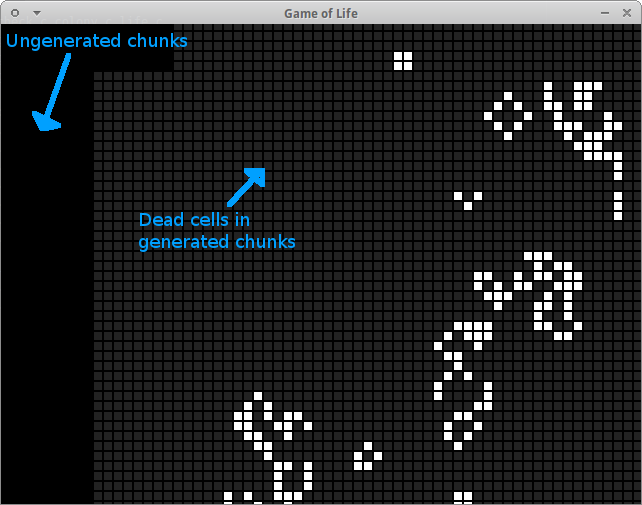

# Infinite and Generic Cellular Automaton Simulator

Defaults to Game of Life. **See screenshot folder**.

An infinite game of life universe, with a graphical player.

License: MIT

## Overview

* Chunk based infinite universe. Automatically expands.
* Interactive player and universe editor using SDL.
* Can set the Born/Survive ruleset code (from command line).
* Can choose the number to steps to take before opening the player
  or outputting to stdout (from command line).
* Has tests.

## Contents

* Usage Guide
	* Dependencies.
	* Compilation and Tests.
	* Command line tool.
	* Using the player.
* Development
	* Extensions.
	* Inspiration / Sources.
* Technical Details
	* The world.
	* Stepping.
	* Limitations / Possible improvements.

# Usage Guide

## Dependencies

Requires SDL2.

## Compilation and Tests

	# Compilation.
	make c

	# Run test.
	./test.sh   # does make test, but uses program return codes.
	./life --tests  # runs life's tests.

## Command line tool

All the following commands either have or implicitly use --stdout

	# Accept a colony from stdin and step it.
	./life

	# Accept a colony from stdin and step it n times.
	./life n
	# eg:
	./live 100

	# Accept a colony from stdin and use the B1357/S1357 ruleset
	./life B1357/S1357

	# Run tests, then accept stdin, and step it, if tests successful.
	./life --tests --stdout

	# Step a colony from ./colony
	./colony 6 | ./life

## Using the player

Space to toggle between pause and play.
S to step / advance one frame.
R to randomly set cells to dead or alive.
Left click to toggle a cell's state.
Drag the view using the middle or right mouse button.

All the following commands have --player

	# Accept a colony from stdin and open the player immediately.
	./life --player

	# Accept a colony from stdin, step it n times, then open the player.
	./life n --player

	# Accept a colony from stdin,  use the B1357/S1357 ruleset and open the player immediately.
	./life B1357/S1357 --player

	# Run tests, accept stdin and step it, if tests successful.
	./life --tests --player

	# Open the player.
	./life --player --no-stdin

	# Load and play a colony from ./colony
	./colony 6 | ./life --player

# Technical Details

## The world

The world is split up into "Chunks". Each chunk has a pointer to the chunks
surrounding it. Chunks are also in a hash table to speed up searching for a chunk
at a position.

## Stepping

The step logic is double buffered. An int array is used in order to count the
neighbours, as each cell accessing the cells around it would be quite expensive.
Whilst updating a chunk the neighbour finding logic looks at surrounding chunks
for overhanging cells.

## Limitations / Possible Improvements

* A possible improvement would be to store the neighbours int array in the
  chunk, and then only update it when a cell is set.
* A looping universe may be an interesting thing to experiment with.
* Store chunk contents as a 64 bit integer instead of a bool array. I was
  originally planning this, but instead spent the time doing the player instead.
* A zooming function, a fill function, or a rectangle drag function would
  be nice.
* Being able to change the ruleset at runtime in the editor would be nice -
  however I rejected this as it would require some sort of SDL GUI library.
  Ctrl+D would have disabled stdin by the point of the player running.
